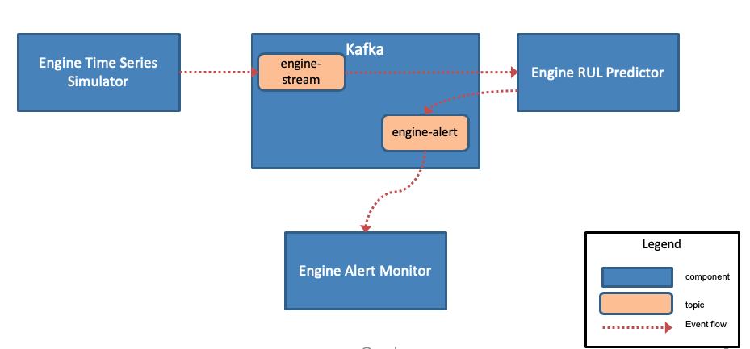

# predictive-maintenance-spark

## Overview
This project simulates the prediction of an aircraft engine’s remaining useful life (RUL) using a survival analysis technique called accelerated failure time model. Determining the time available before a likely failure and being able to predict failures can help business’ better plan the use of their equipment, reduce operation costs, and avert issues before they become significant or catastrophic. The goal of predictive maintenance (PdM) is to allow for corrective actions and prevent unexpected equipment failure.

This project was done in two phases. The first involved training the AFTSurvivalRegression, the second processing that model will simulated events. 

To exercise the prediction, a simulation was run using Spark/SparkML/Kafka and Spark structured streaming.

## Description of Data
The data used for this project is the NASA C-MAPSS Turbofan Engine Degradation Data Set https://ti.arc.nasa.gov/c/6/.  This data is model based simulated data from the Commercial Modular Aero-Propulsion System Simulation (C-MAPSS).

The data set is a multivariate time series. Each entry (row) in the data set reflects an operational cycle of a specific engine identified by engine id and cycle time. There are multiple entries per engine to represent different reporting times. Other columns represents different features 3 operational settings and 21 sensors:

<pre>
1)      engine id
2)      time, in cycles
3)      operational setting 1
4)      operational setting 2
5)      operational setting 3
6)      sensor measurement  1
7)      sensor measurement  2
...
26)     sensor measurement  21
</pre>

The CMAPSS data set is divided in 4 sets each for training, test, and RUL. Each subset represents a different operational condition and consists of a different number of engines.

All engines are assumed to be of the same model type and operating normally at the start of each series.  During its series, it develops a fault.

The cycle is a monotonically increasing integer and for the sake of the model it is assumed to be equally spaced and relative for each engine. The following figure shows 10 time series entry for engine 1.

The data is further divided into a training and test set each that requires some subtly interpretation when being processed.

**Training Data Set**
* The last id, cycle entry is when the engine is declared unhealthy. For example if the first engine has 192 distinct time series events the cycle will go from 1 to 192, while the RUL will start with 192 and go down to 1. During data preparation I add an label column called ‘rul’. This is the ground truth. 

**Test Data Set** 
* Goal is to predict the amount of time remaining before the engine fails. This is referred to as the Remaining Useful Life (RUL).
* An engine’s status is terminated prior to actual engine failure. If the time series for an engine in the test data ends at 41, the model’s goal is to identify the RUL at that point.
* Using the provided RUL, a label column (rul) is added to hold the RUL at each time series.  This is generated in the following way: if the RUL is 112 at time series 41, then time series 1 will have an RUL of 153. The RUL is decremented with each succeeding entry.

The original CMAPSS data was in multiple txt files and were combined into dedicated train (train.csv), test (test_x.csv), test label (test_y.csv). In total the data is 20M compressed.

**Summary**
* NASA C-MAPSS Turbofan Engine Degradation Simulation Data Set https://ti.arc.nasa.gov/c/6/ 
* Size: Training and Test data 20M compressed
* Format: space delimited text files

**Download**

<pre>
$ curl -L https://ti.arc.nasa.gov/c/6/ -o data/CMAPSSDATA.zip
$ (cd data; unzip CMAPSSDATA.zip)
</pre>

## Description of Software
This project is was written using Python version 3.6.4 on the Anaconda platform. The development was done in Jupyter notebooks and Intellij. Notebooks were created for:
* Data analysis
* Data Preparation, Training, Test
* Inference/Prediction

Python scripts were created for:
* Common data manipulation - engine_util.py
* Data visualization (plots) - engine_viz.py
* Kafka event producer - kafka/engine_cycle_producer.py
* Kafka/Spark Structured Streaming Monitor/Producer – kafka/engine_cycle_consumer_struct.py
* Alert Event Consumer - kafka/generic_consumer.py

Support shell scripts for starting demo and services include:
* start_services.sh
* local_kafka.sh
* start-kafka-shell.sh
* start_engine_alert_monitor.sh
* start_engine_monitor.sh
* start_engine_sim.sh 

 
Spark 2.4.0 was installed following the approach followed in the earlier part of class. To support kafka integration the additional jar spark-streaming-kafka-0-10_2.11-2.4.0.jar
 needs to be downloaded from :

https://mvnrepository.com/artifact/org.apache.spark/spark-streaming-kafka-0-10_2.11

This jar was placed in the projects jars directory. Note when the engine monitor is executed as a spark job via spark-submit, the spark-sql-kafka package must be specified. This command can be found in the  start_engine_monitor.sh script:

<pre>
spark-submit --master local[2] --packages org.apache.spark:spark-sql-kafka-0-10_2.11:2.4.0 --jars spark-streaming-kafka-0-10_2.11-2.4.0.jar kafka/engine_cycle_consumer_struct.py localhost:9092 engine-stream -w 30 -s 30 -r 150
</pre>

Spark master is run on CentOS using: $SPARK_HOME/sbin/start-master.sh

To run Kafka and Zookeeper I leveraged Docker images from http://wurstmeister.github.io/kafka-docker/
* Install docker-ce. Follow instructions from https://docs.docker.com/install/linux/docker-ce/centos/#install-docker-ce-1
* Install docker-compose. Docker-compose is used to configure, orchestration and start/stop the containers. Follow these instructions https://docs.docker.com/compose/install/#install-compose

This docker-compose.yml file was used for downloading and starting the containers.

python packages used can be installed with the provided requirements.txt file.
$ pip install -r requirements.txt
